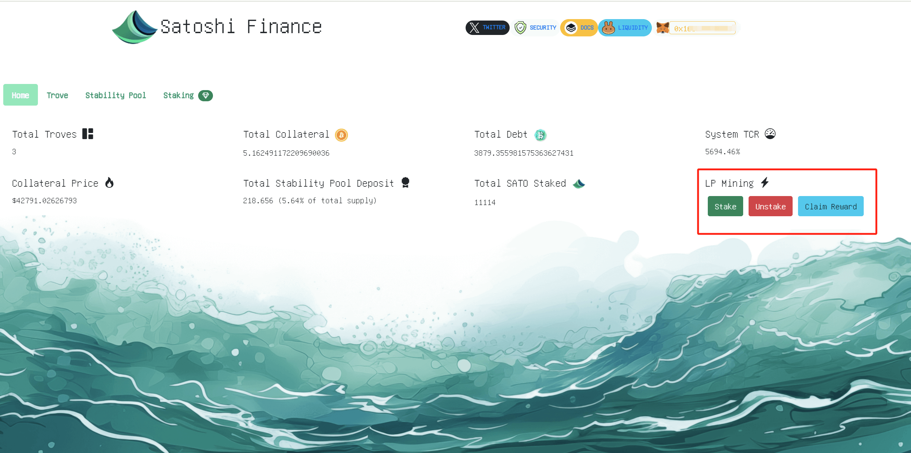

# Testnet usage

## BNB testnet faucet
You could get test BNB for gas cost from this [website](https://www.bnbchain.org/en/testnet-faucet)

## Test collateral faucet

There is a customized collateral contract for test purpose on BNB Smart Chain testnet. 

Connect your wallet in [bscscan](https://testnet.bscscan.com/address/0x5E1Be8984a9E382f0e432bec93d8d245532Bf493#writeContract) and request some test collateral from there.

Note that there is a limit of 10 collateral tokens per day

In above screenshot, input parameter of `wad` is `1000000000000000000` for 1 collateral token since the decimal is 18

## Test btUSD LP faucet

On testnet, same token as above test collateral is used for LP Mining

