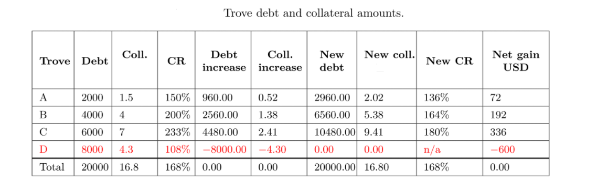

# Liquidation and Stability Pool

## What is the Stability Pool?
The Stability Pool provides source of liquidity to repay debt for liquidatable troves and ensure that the total collateral locked is worth more than the total minted btUSD, i.e., always over-collateralized.

When a trove is liquidated, an amount of btUSD equal to the trove's debt is offset within Stability Pool as repayment(burned directly). As a result, the trove's collateral is distributed among all participants of the Stability Pool. 

The Stability Pool is funded by actors who deposit btUSD into it (called Stability Providers). Over time as liquidation happens, Stability Providers will lose part of their btUSD deposits as repayment offset, but earn a proportional amount of the collateral from the liquidation. Due to the nature of MCR, it is expected that Stability Providers will typically receive a greater face-value of collateral than the debt they pay off. 

For example, if a trove of debt size 1000 btUSD is liquidated at ICR of `108%`, then Stability Provider will earn $1080 worth of collateral by fully repaying 1000 btUSD debt.

## Why should I deposit btUSD to the Stability Pool?
Stability Providers will earn liquidation gains (as explained above) and receive extra growth rewards in form of SATO tokens.

## Why liquidation is needed?
To make sure that the all minted btUSD is fully backed by adequate collateral, troves that fall under the some conditions like below MCR(`110%`) will be liquidated.
 
Note in Recovery Mode, troves with ICR less than the system TCR are also susceptible to liquidation but may expect a collateral surplus for the trove owner to claim. 

For example, if the system TCR drops to `120%`, then system is in recovery mode and a trove with ICR `115%` which is less than TCR will be liquidated but the trove owner could have $115\% - 110\%=5\%$ of its collateral as surplus to claim back. 

Thus it is recommended to keep the trove ICR remain at a relatively higher level like `150%` or even above `200%` in volatile market conditions

## Who can liquidate Troves? 
Anybody can liquidate a Trove as soon as it become liquidatable. The liquidation initiator will receive up to `0.5%` of the trove's collateral as a reward for this service.

## Can I withdraw my deposit from Stability Pool whenever I want?
Each withdrawal would take two on-chain transactions to complete: first request a withdrawal then execute it. 

But the withdrawal request could only be confirmed **after 30 minutes** and there will be a window of 1-hour to execute the withdrawal. After that window, if the withdrawal is not executed, the request is considered expired so the depositor has to make another request.

Also there will be a 12-hours interval requirement between two withdrawal request, i.e., depositor could only make another withdrawal request 12 hours after previous request.

Normally, you can make a withdrawal request for all your deposit in Stability Pool at any time. However, please note that no withdrawal request could be made if the system TCR is below CCR (system in Recovery Mode).

## How do you determine the price of collateral?
The protocol uses primarily [Chainlink’s BTC:USD price feed](https://data.chain.link/bsc/mainnet/crypto-usd/btc-usd), but will failover to the [Binance Oracle](https://oracle.binance.com/data-feeds/detail/bsc/BTC-USD) under the following (extreme) conditions:

* Chainlink price has not been updated for more than 4 hours
* Chainlink response call reverts, returns an invalid price or an invalid timestamp
* The price change between two consecutive Chainlink price updates is $\gt 50\%$

## What happens if the Stability Pool is empty when there is liquidation? 
If the Stability Pool is empty, the system will apply a secondary liquidation mechanism called **redistribution**. It means that the system will redistribute the debt and collateral from liquidated troves to all other remaining troves. The redistribution is in proportion to the individual trove's stake (which is related to its collateral amount). 

Consider a case when collateral price is `$1992.87` and trove D is liquidated with its debt & collateral redistributed among trove A,B,C:
